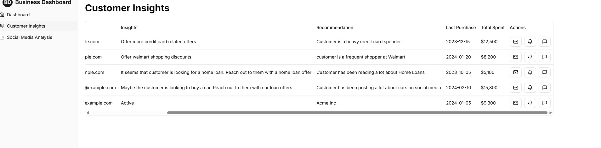

# 🚀 Marketing genius

## 📌 Table of Contents
- [Introduction](#introduction)
- [Demo](#demo)
- [Inspiration](#inspiration)
- [What It Does](#what-it-does)
- [How We Built It](#how-we-built-it)
- [Challenges We Faced](#challenges-we-faced)
- [How to Run](#how-to-run)
- [Tech Stack](#tech-stack)
- [Team](#team)

---

## 🎯 Introduction
Our groundbreaking platform represents a transformative approach to financial product personalization, leveraging state-of-the-art artificial intelligence to create a dynamic, intelligent recommendation ecosystem. By integrating advanced multi-agent AI systems, real-time data processing, and sophisticated insight generation, we've developed a solution that goes beyond traditional marketing approaches, offering unprecedented levels of personalization and customer understanding.

## 🎥 Demo
🔗 [Live Demo](#) (if applicable)  
📹 [Video Demo](#) (if applicable)  
🖼️ Screenshots:





## 💡 Inspiration
What inspired you to create this project? Describe the problem you're solving.

## ⚙️ What It Does
## ✨ Key Features

### 1. Multi-Agent Data Collection & Analysis
- **Comprehensive Data Gathering**
  - Aggregate data from multiple sources including social media, transaction histories, and user interactions
  - Real-time data collection and processing
  - Hourly updates of insights and trends

### 2. Advanced Personalization Engine
- **Intelligent Recommendation System**
  - AI-powered insights for financial products
  - Personalized recommendations for:
    * Credit Cards
    * Home Loans
    * Mortgages
    * Auto Loans
  - Multi-modal personalization leveraging text, image, and voice inputs

### 3. Targeted Marketing Capabilities
- **Adaptive Marketing Channels**
  - Customer Targeting:
    * SMS
    * Phone Notifications
    * Email
  - Non-Customer Targeting:
    * Meta Ads
    * Instagram Ads
    * LinkedIn Ads
- **AI-Generated Content**
  - Multimodal ad creation
  - Sentiment-driven content generation

### 4. Continuous Feedback Analysis
- **Social Media Monitoring**
  - Real-time brand perception analysis
  - Customer pain point identification
  - Sentiment tracking across platforms

### 5. Ethical AI Considerations
- **Responsible AI Principles**
  - Data privacy management
  - Financial compliance integration
  - Consent management
  - Bias detection and mitigation
    
## 🛠️ How We Built It
## 🧠 Overall Architecture

Our platform is built on a microservices-based, event-driven architecture that leverages cutting-edge AI technologies to create a seamless, intelligent recommendation system.

## 🔬 Technical Components

### 1. Data Collection Layer
#### Technologies
- **Zapier**: Automated data integration
- **Firebase**: Real-time data management
- **Firestore**: NoSQL document database

#### Key Implementation
```python
# Sample data collection agent
class DataCollectionAgent:
    def __init__(self, sources):
        self.sources = sources
        self.firestore_client = initialize_firestore()
    
    def collect_social_media_data(self):
        # Aggregate data from multiple social platforms
        pass
    
    def collect_transaction_data(self):
        # Fetch and normalize financial transaction data
        pass
```

### 2. AI-Powered Insight Generation
#### Technologies
- **LangChain**: AI agent framework
- **Gemini**: Large Language Model
- **Firebase Functions**: Serverless compute

#### Trend Discovery Implementation
```python
def discover_financial_trends(collected_data):
    """
    Analyze collected data to generate actionable insights
    
    Args:
        collected_data (dict): Aggregated data from various sources
    
    Returns:
        dict: Processed insights and recommendations
    """
    # Use Gemini for advanced trend analysis
    insights = gemini_model.generate_insights(collected_data)
    
    # Apply LangChain for structured reasoning
    processed_insights = langchain_agent.refine_insights(insights)
    
    return processed_insights
```

### 3. Personalization Engine
#### Multi-Modal Approach
- **Text Processing**: Natural Language Understanding
- **Image Analysis**: Computer Vision
- **Voice Input**: Speech-to-Text Processing

#### Recommendation Generation
```python
class PersonalizationEngine:
    def generate_recommendations(self, user_profile, financial_trends):
        """
        Create hyper-personalized recommendations
        
        Args:
            user_profile (dict): Comprehensive user data
            financial_trends (dict): Current market insights
        
        Returns:
            list: Tailored product recommendations
        """
        # Combine user profile with market trends
        contextual_recommendations = self.ai_model.generate(
            user_profile, 
            financial_trends
        )
        
        return contextual_recommendations
```

### 4. Marketing Automation
#### Multi-Channel Targeting
- **SMS Gateway**: Direct messaging
- **Email Services**: Detailed communications
- **Ad Platform Integrations**: 
  - Meta Ads
  - LinkedIn Ads
  - Instagram Ads

#### Content Generation Agent
```python
def generate_marketing_content(user_segment, recommendation):
    """
    Create personalized marketing content
    
    Args:
        user_segment (str): Target user group
        recommendation (dict): Specific product recommendation
    
    Returns:
        dict: Multimodal marketing content
    """
    # Use Gemini for content generation
    ad_copy = gemini_model.generate_ad_copy(
        user_segment, 
        recommendation
    )
    
    # Generate multimodal content
    content = {
        'text_ad': ad_copy,
        'image_ad': generate_image(ad_copy),
        'targeting_parameters': optimize_targeting(user_segment)
    }
    
    return content
```

### 5. Feedback and Continuous Learning
#### Monitoring Mechanisms
- **Reddit API**: Community sentiment analysis
- **Social Media Scrapers**: Brand perception tracking
- **Sentiment Analysis**: Continuous feedback loop

## 🔒 Ethical AI Considerations

### Privacy and Compliance
- **Data Anonymization**: Remove personally identifiable information
- **Consent Management**: User-controlled data sharing
- **Bias Detection**: Continuous model auditing

### Bias Mitigation Strategy
```python
def detect_recommendation_bias(recommendations):
    """
    Analyze recommendations for potential biases
    
    Args:
        recommendations (list): Generated product suggestions
    
    Returns:
        dict: Bias assessment report
    """
    bias_checks = [
        'demographic_fairness',
        'socioeconomic_representation',
        'product_accessibility'
    ]
    
    bias_report = bias_detection_model.assess(
        recommendations, 
        bias_checks
    )
    
    return bias_report
```

## 🚀 Deployment Strategy
- **Backend**: Python Flask on Google Cloud Run
- **Frontend**: Next.js Frontend deployed on Firebase Hosting
- **Database**: Firebase Firestore

## 🚧 Challenges We Faced
Describe the major technical or non-technical challenges your team encountered.

## 🏃 How to Run
1. Clone the repository  
   ```sh
   git clone https://github.com/your-repo.git
   ```
2. Install dependencies  
   ```sh
   npm install  # or pip install -r requirements.txt (for Python)
   ```
3. Run the project  
   ```sh
   npm start  # or python app.py
   ```

## 🏗️ Tech Stack
- 🔹 Frontend: Next.js/Tailwind CSS
- 🔹 Backend: Node.js / Flask / GCP
- 🔹 Database: Firebase Firestore and Firebase Storage
- 🔹 Other: Gemini API/ Vertex Imagen API / Zapier

## 👥 Team
- **Avhijit nair** - [GitHub](#) | [LinkedIn](#)
- **Devam Kakoty** - [GitHub](#) | [LinkedIn](#)
